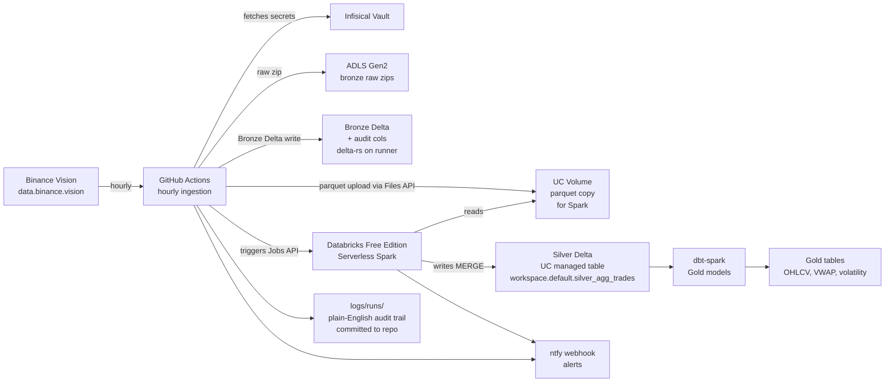

# TickStream Lakehouse

End-to-end financial data pipeline on real public crypto tick data. Built entirely on GitHub plus free-tier cloud services. Demonstrates production-grade data engineering: medallion architecture, Delta Lake, PySpark on Databricks, dbt, vault-backed secrets, plain-English handover logs, observability, and data governance.

**Owner**: [Tharindi-W](https://github.com/Tharindi-W)
**Status**: Phase 3 complete, Phase 4 (Gold + dbt) in progress
**Data**: real public crypto tick data from [Binance Vision](https://data.binance.vision/)
**Cost**: $0 (free tiers only)

## What works today

Run an hourly cron from GitHub Actions, the pipeline:

1. Downloads yesterday's daily aggregated trades from Binance Vision for BTCUSDT, ETHUSDT, SOLUSDT (over 3 million real trades per day).
2. SHA-256 hashes each file. Skips silently if unchanged. Fires an ntfy alert if Binance is unreachable.
3. Lands raw zips in Azure Data Lake Storage Gen2 under `bronze/raw/symbol=X/batch_date=Y/`.
4. Writes a Bronze Delta table to ADLS with audit columns, using `deltalake-rs` (no Spark needed at this layer).
5. Uploads a parquet copy of each batch to a Databricks Unity Catalog Volume via the Files API.
6. Kicks off a Databricks Free Edition Serverless Spark job via the Jobs REST API.
7. PySpark notebook reads the Volume, casts strings into proper types (Decimal(38,8) for price/qty, Timestamp from epoch-ms, Bool for the trade flags), computes a validity flag, deduplicates within `(symbol, batch_date, agg_trade_id)`, applies governance TBLPROPERTIES, and writes to a UC managed Delta table.
8. Auto-commits a plain-English Markdown run log to the repository so the audit trail lives next to the code.
9. ntfy notifies on success or failure.

**As of the last successful run**: 3,277,567 rows in `workspace.default.silver_agg_trades` for batch 2026-06-02. Real PySpark, real Delta MERGE, real Unity Catalog table.

## Demo (for reviewers)

Open the Databricks workspace, SQL editor, paste:

```sql
SELECT
    symbol,
    COUNT(*)            AS rows,
    MIN(transact_time)  AS first_trade,
    MAX(transact_time)  AS last_trade,
    AVG(price)          AS avg_price,
    SUM(quantity)       AS day_volume
FROM workspace.default.silver_agg_trades
GROUP BY symbol
ORDER BY symbol;
```

You will see three rows, one per symbol, with real averages and volumes from the most recently processed UTC day.

## Architecture



## Stack (everything free)

| Concern | Tool | Why |
|---|---|---|
| Source of truth | GitHub | All code, configs, dashboards, governance docs, run logs |
| Orchestration | GitHub Actions | Hourly cron + workflow_dispatch + workflow chain |
| Compute, light | GitHub Actions runner | `deltalake-rs` for Bronze Delta writes, no Spark needed |
| Compute, heavy | Databricks Free Edition Serverless | Real PySpark, real Delta MERGE, real Unity Catalog |
| Storage, source-of-record | Azure ADLS Gen2 | Free for 12 months, hierarchical namespace enabled |
| Storage, Spark-readable | UC Volume `workspace.default.tickstream_bronze` | Free-Edition-friendly bridge (see HANDOVER for why) |
| Table format | Delta Lake | ACID, MERGE for idempotency, time travel, schema enforcement |
| Secrets vault | Infisical | Open-source vault. Only the bootstrap identity lives in GitHub. |
| Transforms | dbt-spark on Databricks SQL warehouse | Industry standard for the Silver-to-Gold layer |
| Data quality | Soda Core (Silver) + dbt tests (Gold) | Two layers, declarative |
| Alerts | ntfy.sh webhook | Free, durable, no app install required |
| CI | ruff, mypy, pytest, pre-commit (coming) | PR-gated quality gates |

## Documentation

Three documents at the root, in order of who they are for:

| File | Audience | Contents |
|---|---|---|
| [README.md](README.md) | First-time reader, recruiter | What this is, what works, how to demo it |
| [LEARNING.md](LEARNING.md) | Someone learning the patterns | Step-by-step build journal, decisions explained in plain English, incident logs |
| [HANDOVER.md](HANDOVER.md) | Next maintainer (human or agent) | Operational decision log, why each choice was made, dead ends and pivots |

## Repository layout

| Path | Contents |
|---|---|
| `ingestion/binance_vision.py` | HEAD + GET + SHA-256 hashing of Binance Vision daily files |
| `pipeline/bronze/land_to_bronze.py` | Bronze orchestrator: download, dedup, ADLS write, UC Volume upload |
| `pipeline/silver/transform_silver.py` | Databricks notebook source (committed in git, deployed to workspace per run) |
| `pipeline/common/` | Config loader, plain-English run logger, state file I/O |
| `alerts/notifier.py` | Generic webhook alert sender (ntfy today, swappable) |
| `config/pipeline.yml` | Non-secret tunable knobs (symbol list, thresholds, retention windows) |
| `config/secrets_required.md` | Full secrets registry with rotation policy and blast-radius notes |
| `state/last_seen_hashes.json` | SHA-256 of last-ingested file per symbol, auto-committed each run |
| `logs/runs/` | Per-run Markdown logs, auto-committed by the workflow |
| `.github/workflows/` | All GitHub Actions YAML |
| `dbt/` | dbt-spark project for Gold transformations (Phase 4) |

## Notable engineering choices

A few decisions worth a hiring manager's attention. Detail is in `HANDOVER.md`.

1. **One bootstrap secret pattern.** Only three secrets live in GitHub Actions Secrets: an Infisical machine identity client id, client secret, and project id. Every operational secret (Azure key, Databricks token, ntfy URL) is fetched from Infisical at workflow start. This is the production-shape secret hygiene pattern. If GitHub were compromised, the attacker would still need Infisical access.
2. **Honest framing of free-tier compromises.** Databricks Free Edition blocks `fs.azure.*` Spark configs (Spark Connect denylist) and lives in Databricks' own Azure tenant. We documented the architectural reasons in HANDOVER, attempted the "correct" Path C (UC External Location), proved it does not work on Free Edition due to cross-tenant managed identity restrictions, and pivoted to Path B (UC Volume copy). The Azure Access Connector and role assignment we created remain valid for the day this project migrates to paid Azure Databricks.
3. **No misapplied security theatre.** Crypto tick data is public. We do NOT encrypt it. The repo includes an AES utility as a labelled demo on a synthetic PII column to show the skill without misapplying it. SHA-256 is used where it adds real value (file integrity, change detection).
4. **Plain-English run logs in version control.** Every pipeline run writes one Markdown file with timestamps for every stage, row counts, status, and any errors. The workflow commits these back to the repo so the audit trail lives next to the code that produced it.
5. **Idempotency by Delta MERGE.** Silver `MERGE`s on `(symbol, batch_date, agg_trade_id)`. Re-running the same batch produces identical results. State file backs this up with a SHA-256 dedup that avoids unnecessary work in the first place.

## Quickstart

You cannot run this end-to-end without your own Azure subscription, Infisical workspace, and Databricks Free Edition workspace. The full setup is documented step by step in `LEARNING.md` under each Phase. The README is for understanding what was built; LEARNING.md is for reproducing it.

## License

MIT (to be added).
