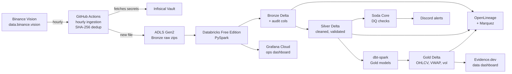

# TickStream Lakehouse

End-to-end financial data pipeline on real public crypto tick data. Built entirely on GitHub plus free tier cloud services. Demonstrates production-grade data engineering: medallion architecture, Delta Lake, PySpark, dbt, vault-backed secrets, plain-English handover logs, observability dashboards, and data governance.

**Owner**: [Tharindi-W](https://github.com/Tharindi-W)
**Status**: under construction (Phase 0 of 8)
**Data**: real public crypto tick data from [Binance Vision](https://data.binance.vision/)
**Cost**: $0 forever (free tiers only)

## Why this project exists

A portfolio-grade lakehouse built so a future maintainer (human or AI agent) can take it over from documentation alone, with no tribal knowledge required. Every design decision is recorded in plain English in [HANDOVER.md](HANDOVER.md). The educational walk-through of how it was built is in [LEARNING.md](LEARNING.md).

## Architecture

## Stack

| Concern | Tool | Why |
|---|---|---|
| Source of truth | GitHub | Code, configs, logs, handover all in one place |
| Orchestration | GitHub Actions | Hourly cron plus manual trigger |
| Compute | Databricks Free Edition | PySpark, Delta, notebooks, Jobs API |
| Storage | Azure ADLS Gen2 | Free tier 12 months, real enterprise object store |
| Table format | Delta Lake | ACID, time travel, MERGE for idempotency |
| Secrets vault | Infisical | Open source, real vault semantics |
| Data quality | Soda Core | Declarative YAML DQ checks |
| Transforms | dbt-spark | Silver to Gold in SQL with tests and lineage |
| Lineage | OpenLineage + Marquez | Cross-job lineage graph |
| Data dashboard | Evidence.dev | Static site to GitHub Pages, version controlled |
| Ops dashboard | Grafana Cloud | Run duration, freshness, alert tile |
| Alerts | Discord webhook | Free, simple, durable |
| CI | ruff, mypy, pytest, pre-commit | PR-gated quality gates |

## Repository layout

| Path | Contents |
|---|---|
| `README.md` | This file |
| `HANDOVER.md` | Plain-English running log of decisions, for the next maintainer |
| `LEARNING.md` | Walk-through of how the project was built, for upskilling |
| `config/pipeline.yml` | Non-secret pipeline configuration |
| `ingestion/` | Python scripts that download from Binance Vision |
| `pipeline/bronze/` | PySpark to land raw to Bronze Delta |
| `pipeline/silver/` | PySpark cleaning and validation |
| `pipeline/gold/` | dbt-spark project for Gold aggregations |
| `dq/` | Soda Core checks |
| `governance/` | Role matrix, data dictionary, table properties |
| `alerts/` | Alert webhooks |
| `encryption/` | SHA-256 and AES utilities |
| `maintenance/` | OPTIMIZE, VACUUM, log rotation, archival |
| `dashboard/` | Evidence.dev project and Grafana dashboard JSON |
| `tests/` | pytest unit tests |
| `architecture/` | Architecture diagrams |
| `.github/workflows/` | GitHub Actions YAML |
| `logs/runs/` | Per-run plain-English logs, auto-rotated at 50 days |

## Quickstart

Not runnable yet. Phase 0 is repo scaffolding only. See [HANDOVER.md](HANDOVER.md) for current state and [LEARNING.md](LEARNING.md) for the educational walkthrough.

## License

MIT (to be added).
